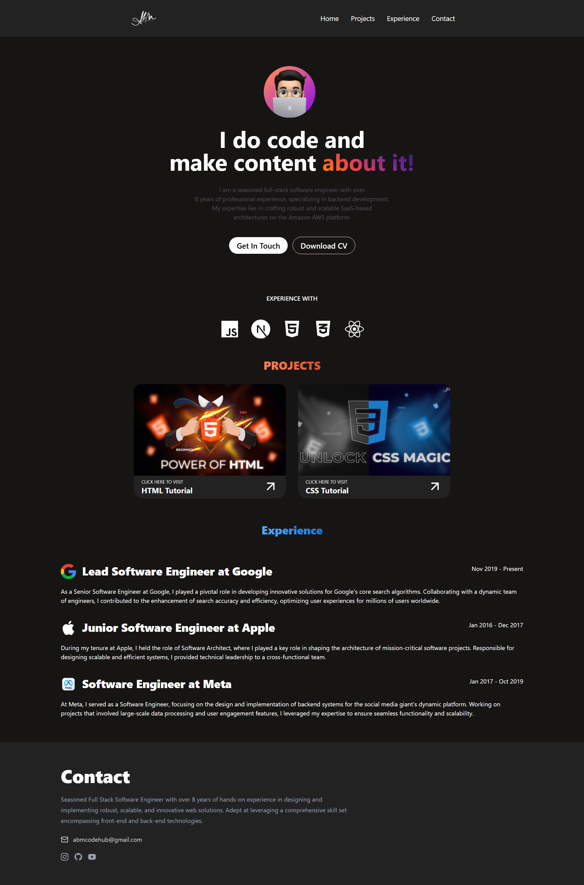

<div align="center">

# 🚀 React Project Name

### Modern React Application Built With React + Vite



<br/>


<br/>
<br/>

</div>

---

# ✨ Features

✅ Modern UI Design  
✅ Fully Responsive  
✅ Fast Performance  
✅ Reusable Components  
✅ Clean Folder Structure  
✅ React Router Setup  
✅ Mobile Friendly  
✅ Optimized Code

---

# 📸 Screenshots

| Home Page |
|---|---|
|  |

---

# 🛠️ Tech Stack

| Technology | Usage |
|---|---|
| React | Frontend Library |
| Vite | Build Tool |
| Tailwind CSS | Styling |


---

# 📂 Folder Structure

```bash id="3h6xpj"
src/
 ├── assets/
 ├── components/
 ├── App.jsx
 └── main.jsx